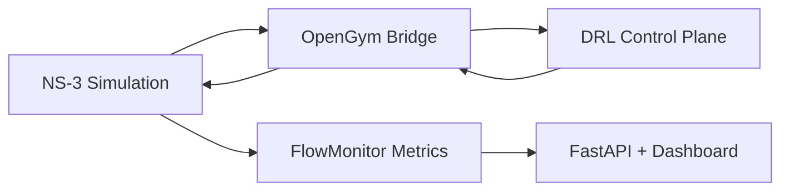
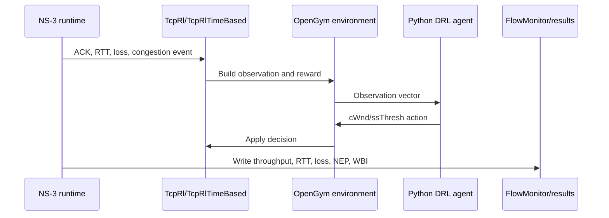
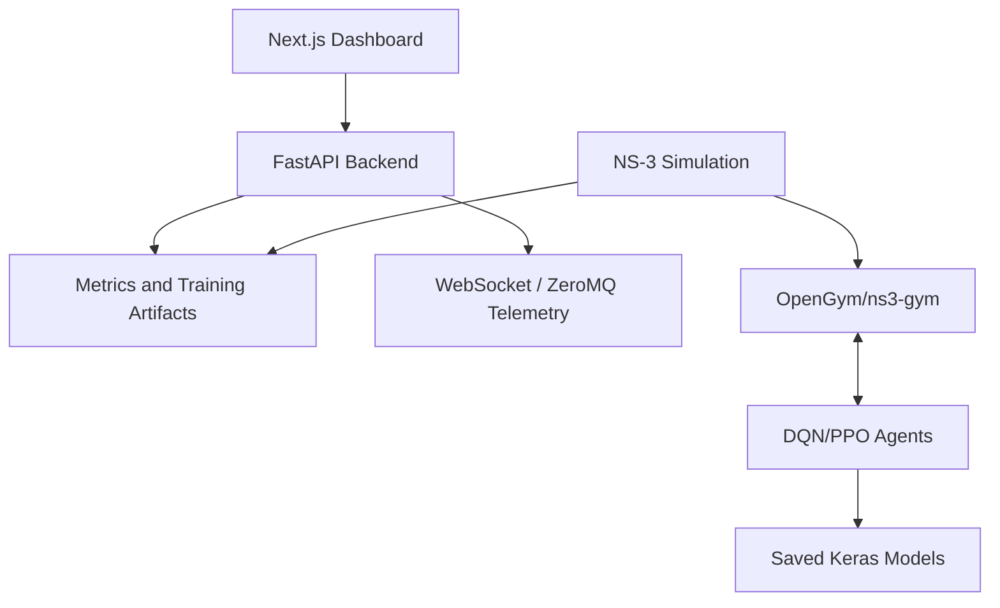
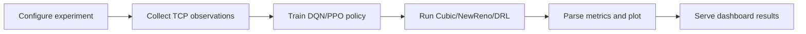

# NeuroTCP

Deep reinforcement learning based TCP congestion control using NS-3, OpenGym/ns3-gym, Python agents, FastAPI, and a Next.js dashboard.

[](https://www.nsnam.org/)
[](https://github.com/tkn-tub/ns3-gym)
[](https://fastapi.tiangolo.com/)
[](https://nextjs.org/)
[](https://arxiv.org/html/2508.01047v3)

## Overview

NeuroTCP is a research prototype that studies TCP congestion control as a reinforcement learning problem. Instead of relying only on loss-based congestion signals, the system exposes TCP socket state from NS-3 to a Python learning agent through OpenGym. The agent observes network behavior, selects congestion-window actions, and is evaluated against TCP Cubic and TCP NewReno.

The project includes:

- Custom NS-3 congestion-control classes for RL-controlled TCP.
- Event-based and timestep-based OpenGym environments.
- DQN and PPO agent implementations with saved training artifacts.
- FlowMonitor based metric collection for throughput, RTT, packet loss, NEP, and WBI.
- Statistical analysis and comparison plotting.
- FastAPI endpoints and WebSocket telemetry for dashboard consumption.
- A Next.js dashboard for overview, analytics, comparison, training, transfer, live telemetry, configuration, commits, and documentation.

## Website Documentation

The detailed documentation is integrated into the website at:

```text
http://localhost:3000/documentation
```

The documentation page follows the existing dashboard theme and includes the four system architecture views from the supplied Eraser workspace: high-level architecture, control-loop sequence, module/deployment architecture, and learning/evaluation pipeline.

## Results Snapshot

Measured from the included `backend/results_*.txt` files:

| Algorithm   | Average throughput | Average RTT | Total packet loss |
| ----------- | -----------------: | ----------: | ----------------: |
| DRL-TCP     |         9.498 Mbps |   14.844 ms |                76 |
| TCP Cubic   |         8.051 Mbps |   30.155 ms |               252 |
| TCP NewReno |         7.514 Mbps |   35.208 ms |               355 |

The included data shows DRL-TCP achieving the highest average throughput and the lowest average RTT in this setup. The result direction is consistent with the referenced arXiv work, which reports that a DQN-based TCP controller can preserve comparable throughput while reducing RTT against Cubic and NewReno.

## System Architecture

The project architecture is documented in the website. At a high level, the system is organized into four views:

### 1. High-Level System Architecture



This view explains how NS-3, custom TCP RL classes, OpenGym environments, and Python agents form a closed congestion-control loop.

### 2. Control-Loop Sequence



This view describes how a simulation event becomes an observation, how the agent responds, and how the result is recorded.

### 3. Module and Deployment Architecture



This view maps repository modules to runtime responsibilities: UI, API, simulation, learning, telemetry, and artifacts.

### 4. Learning and Evaluation Pipeline



This view captures the experiment lifecycle from parameter selection to final visualization.

## Repository Structure

```text
backend/
  NS-3 simulation files, TCP RL classes, metrics, FastAPI service

backend/api/
  API routes for metrics, simulation command generation, training, transfer, and live telemetry

DRL-Agent/
  DQN/PPO agent implementations, training outputs, baseline comparison results, plots

frontend/
  Next.js dashboard, visual components, routes, Tailwind theme, documentation page

kernel/
  Experimental Linux kernel TCP module prototype

implementation.md
  Original implementation plan and commit schedule

docker-compose.yml
  Local backend/frontend orchestration
```

## Tech Stack

| Layer      | Technologies                                                                     | Purpose                                            |
| ---------- | -------------------------------------------------------------------------------- | -------------------------------------------------- |
| Simulation | NS-3, C++, FlowMonitor                                                           | Network topology, TCP execution, metric collection |
| RL bridge  | OpenGym, ns3-gym                                                                 | Communication between NS-3 and Python agents       |
| Learning   | Python, TensorFlow/Keras, DQN, PPO, NumPy                                        | Policy training and inference                      |
| Analysis   | Pandas, SciPy, Matplotlib                                                        | Parsing, statistical comparison, graph generation  |
| Backend    | FastAPI, Uvicorn, ZeroMQ, WebSocket                                              | Metrics API and live telemetry                     |
| Frontend   | Next.js 14, React, TypeScript, Tailwind CSS, Recharts, React Flow, Framer Motion | Dashboard and documentation                        |
| Deployment | Docker, Docker Compose                                                           | Local multi-service execution                      |

## Important Parameters

| Parameter            | Value                             |
| -------------------- | --------------------------------- |
| OpenGym port         | `5555`                            |
| Environment timestep | `0.1 s`                           |
| Default duration     | `10 s`                            |
| Bottleneck link      | `2 Mbps / 10 ms`                  |
| Access links         | `10 Mbps / 20 ms`                 |
| MTU                  | `400 bytes`                       |
| TCP buffers          | `4 MB` send and receive           |
| TCP options          | SACK enabled, delayed ACK count 2 |
| DQN action set       | keep, `+1500`, `-150`, `+4000`    |
| Optimizer            | Adam, learning rate `1e-3`        |
| Discount factor      | `0.95`                            |

## Running the Project

### Docker

```bash
docker compose up --build
```

Services:

```text
Backend API: http://localhost:8000
Frontend:    http://localhost:3001
```

### Backend API

```bash
cd backend/api
pip install fastapi uvicorn pandas pyzmq
uvicorn server:app --host 0.0.0.0 --port 8000 --reload
```

Useful endpoints:

```text
GET  /health
GET  /api/metrics
GET  /api/metrics/summary
GET  /api/metrics/{DRL|Cubic|NewReno}
POST /api/simulation
WS   /api/live
```

### Frontend Dashboard

```bash
cd frontend
npm install
npm run dev
```

Default local route:

```text
http://localhost:3000
```

Documentation route:

```text
http://localhost:3000/documentation
```

### NS-3 Simulation

From a configured NS-3 workspace with OpenGym/ns3-gym support:

```bash
./waf configure --enable-examples --enable-tests
./waf build
./waf --run "scratch/sim --transport_prot=TcpNewReno --duration=10"
./waf --run "scratch/sim --transport_prot=TcpCubic --duration=10"
./waf --run "scratch/sim --transport_prot=TcpRlTimeBased --duration=10"
```

### Metrics Analysis

```bash
cd backend
python parse_metrics.py
```

The parser reads the included result files, compares DRL-TCP against Cubic and NewReno, and writes comparison plots to `backend/graphs/`.

## Contributors

| Member           | Primary contribution                                                                                                            |
| ---------------- | ------------------------------------------------------------------------------------------------------------------------------- |
| Shivam Kumar     | OpenGym environment bridge, base environment, event-based environment, timestep environment, reward logic, congestion callbacks |
| Tushar Saharan   | NS-3 simulation skeleton, TCP configuration, dumbbell topology, applications, FlowMonitor metrics, CSV output                   |
| Varun Pandey     | Metrics parser, statistical comparison, Matplotlib plots, simulation result files, live telemetry dashboard integration         |
| Kunal Khandelwal | TCP RL congestion-control classes, event and timestep variants, comparison/training/config dashboard pages                      |
| Aryan Pandey     | FastAPI scaffold, frontend dashboard foundation, animated UI, commit tracker, CORS and API port fixes                           |
| Chinmay Raheja   | DQN and PPO agents, training artifacts, baseline comparison runs, final result summaries and comparison plots                   |

## Limitations

- This is a research prototype evaluated primarily in simulation.
- The reported results depend on topology, bottleneck rate, delay, MTU, queue behavior, traffic pattern, reward design, and training configuration.
- Learned policies may not generalize to unseen network distributions without retraining or transfer learning.
- The dashboard is an observability and demonstration layer; reproducibility still depends on a correctly configured NS-3/OpenGym environment.
- The kernel module is experimental and should not be treated as deployment-ready.

## References

- Efe Aglamazlar, Emirhan Eken, Harun Batur Gecici. [A Deep Reinforcement Learning-Based TCP Congestion Control Algorithm: Design, Simulation, and Evaluation](https://arxiv.org/html/2508.01047v3). arXiv:2508.01047v3.
- [Supplied Eraser architecture workspace](https://app.eraser.io/workspace/zOV3c2oGyuDJJGuhXldf)
- [NS-3 Network Simulator](https://www.nsnam.org/)
- [ns3-gym OpenGym interface](https://github.com/tkn-tub/ns3-gym)
- [FastAPI](https://fastapi.tiangolo.com/)
- [Next.js](https://nextjs.org/)

## Citation

```bibtex
@misc{aglamazlar2025drl_tcp,
  title = {A Deep Reinforcement Learning-Based TCP Congestion Control Algorithm: Design, Simulation, and Evaluation},
  author = {Aglamazlar, Efe and Eken, Emirhan and Gecici, Harun Batur},
  year = {2025},
  eprint = {2508.01047},
  archivePrefix = {arXiv},
  primaryClass = {cs.NI}
}
```
